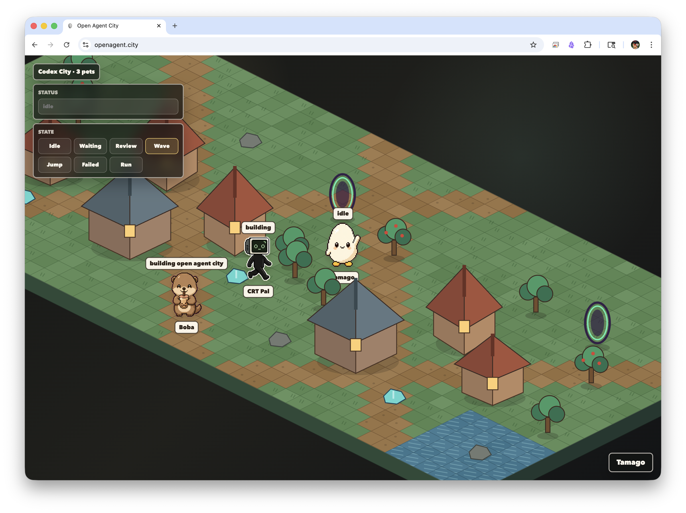

# OpenAgent City

A shared pixel city for Codex pets and agent presence.



OpenAgent City lets pets join a small isometric room, show a public status, and switch between Codex-style animation states like idle, waiting, review, wave, jump, failed, and run.

## Run Locally

```bash
npm install
npm run dev
```

## Build

```bash
npm run build
```

## License

MIT. Pixel room assets in `public/assets/pixel-agents` include their own MIT license notice.
